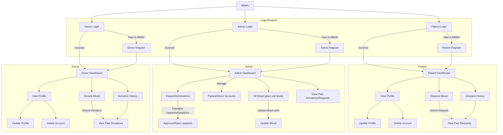

# BBMS - Blood Bank Management System

Blood Bank Management System (BBMS) is a web-based application designed to efficiently manage blood donations, donors, and recipients. It provides an integrated platform for donors and recipients to ensure the availability of safe and life-saving blood for those in need.

## Table of Contents
- [Prerequisites](#prerequisites)
- [Deployment](#deployment)
- [Installation](#installation)
- [Usage](#usage)
- [Flowchart](#flowchart)
- [Features](#features)
- [Screenshots](#screenshots)
- [Technologies Used](#technologies-used)

## Prerequisites

Before you begin, ensure you have met the following requirements:

- **XAMPP**: You need XAMPP installed for hosting the application. XAMPP includes Apache, MySQL, PHP, and phpMyAdmin, which are essential for running the application.
- **Git (Optional)**: If you want to clone the repository from GitHub.

For a detailed guide on how to install XAMPP on Linux, you can watch this [video](https://www.youtube.com/watch?v=XoKUkdmfTZQ).

## Deployment

For a detailed guide on how to deploy a PHP and MySQL application on the internet, you can watch this [video](https://youtu.be/IbUmbYKY_Q4?si=1Od8XSaNmLZ8CRiY).

### Quick Deployment Steps:
1. Purchase a domain and hosting service.
2. Upload the project files to the server using FTP or cPanel.
3. Import the `bbms.sql` database on the hosting provider's MySQL server.
4. Update database credentials in the `config.php` file.
5. Access the application via the domain URL.

## Installation

To set up the BBMS application with XAMPP in your Linux environment, follow these steps:

1. Clone the repository into your local machine in the directory where your PHP web server is serving files (usually `/opt/lampp/htdocs`).
   ```bash
   git clone https://github.com/Farheen-18/Blood_Bank_Management_System
   ```
2. Start XAMPP by running the following command:
   ```bash
   sudo /opt/lampp/lampp start
   ```
3. Open phpMyAdmin in your web browser:
   ```
   http://localhost/phpmyadmin/
   ```
4. Create a database named `BBMS` and import the `bbms.sql` file located in `/opt/lampp/htdocs/BBMS/database`.
5. Access the application in your web browser:
   ```
   http://localhost/BBMS/index.php
   ```

## Usage

- **Login**: Users can log in with their respective roles (patient, donor, or admin) using their credentials.
- **Patients**: Have access to their profiles, blood donation requests, and request history.
- **Donors**: Can view their profile, blood donations, and check their donation history.
- **Admin**: Have access to user and donation management features.

## Flowchart



## Features

- User authentication and role-based authorization for patients, donors, and admins.
- Profile management for patients and donors.
- Blood donation request system to request specific blood types.
- Donation history tracking for transparency.
- Admin panel for managing users, blood inventory, and donations.

## Screenshots

### Login Page


### Dashboard


### Blood Request Form


## Technologies Used

- **PHP**: Backend scripting language.
- **MySQL**: Database management system.
- **Bootstrap**: Front-end framework for styling.
- **Apache**: Web server.

---

Enjoy using BBMS and feel free to contribute to its development!


